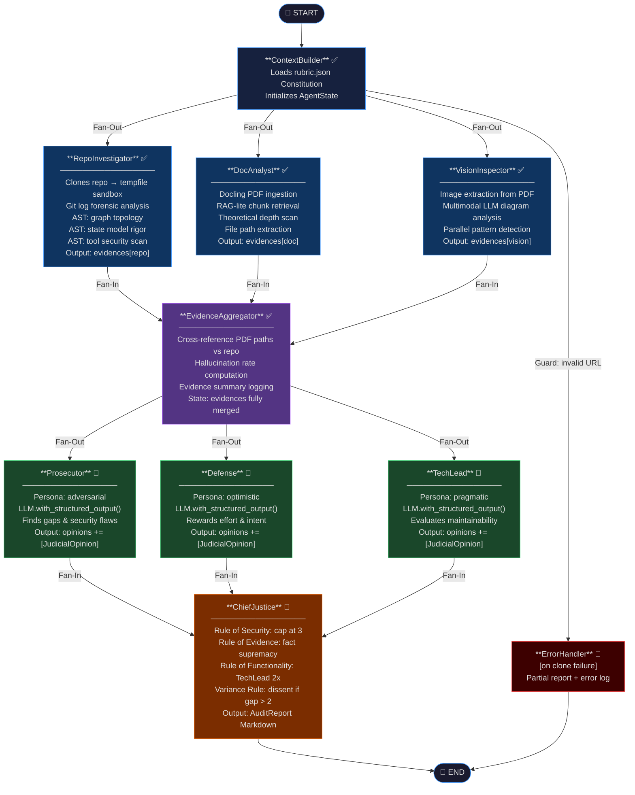

# Automaton Auditor — Interim Architecture Report

---

| Field | Value |
|---|---|
| **Project** | FDE Challenge Week 2 — The Automaton Auditor |
| **Version** | 0.1.0 (Interim) |
| **Submission Type** | Wednesday Interim |
| **Date** | 2026-02-25 |
| **Author** | FDE Candidate — GitHub: [78gk](https://github.com/78gk) |
| **Repository** | https://github.com/78gk/The-Automaton-Auditor |
| **Status** | Detective Layer Complete · Judicial Layer Scheduled (Thu–Sat) |

---

## Executive Summary

The **Automaton Auditor** is a production-grade hierarchical multi-agent swarm built with LangGraph, designed to perform forensic quality assurance on AI-generated codebases. It operationalizes the **Digital Courtroom** metaphor across three distinct layers:

- **Detective Layer** — three parallel agents (`RepoInvestigator`, `DocAnalyst`, `VisionInspector`) collect objective forensic facts using AST parsing, Git log analysis, and RAG-lite PDF ingestion. They produce typed `Evidence` objects — no opinions, no scores.
- **Judicial Layer** — three adversarial judges (`Prosecutor`, `Defense`, `TechLead`) independently evaluate the same evidence through distinct philosophical lenses, producing structured `JudicialOpinion` objects via `.with_structured_output()`.
- **Supreme Court** — the `ChiefJustice` node applies **deterministic Python rules** (not LLM averaging) to synthesize a final `AuditReport` in Markdown.

This interim report documents the architectural decisions made during Phase 0–2 (Infrastructure + Detective Layer), the StateGraph orchestration design, known gaps, and a risk-mitigated completion plan for the Judicial and Synthesis layers.

---

## 1. Architecture Decisions

Each decision follows the format: **Context → Options Considered → Selected Solution → Impact**.

---

### 1.1 State Management: Pydantic BaseModel + TypedDict with Annotated Reducers

**Context & Problem:**
A multi-agent swarm with 6+ parallel agents all writing to a single shared state object. The core risk: without explicit merge semantics, the last agent to finish overwrites all others' data — a silent, catastrophic data loss that produces no error and is invisible at runtime.

**Options Considered:**

| Option | Pros | Cons |
|---|---|---|
| **Plain Python dicts** | Zero boilerplate, familiar | Silent overwrites in parallel, no schema, no validation, impossible to audit |
| **Python dataclasses** | Typed, lightweight | No field-level validators, no `ge`/`le` constraints, no JSON serialization |
| **TypedDict only** | LangGraph-native, minimal | No runtime validation, no `Field(ge=1, le=5)` enforcement |
| **Pydantic BaseModel + TypedDict with Annotated reducers** ✅ | Runtime validation, reducer semantics, self-documenting, LangGraph-compatible | Slightly more verbose |

**Selected Solution & Justification:**
- `AgentState` as `TypedDict` (required by LangGraph's `StateGraph`)
- All data objects (`Evidence`, `JudicialOpinion`, `CriterionResult`, `AuditReport`) as Pydantic `BaseModel`
- `Annotated[Dict[str, List[Evidence]], operator.ior]` — dict union merge: each Detective writes to its own key (`"repo"`, `"doc"`, `"vision"`) without overwriting others
- `Annotated[List[JudicialOpinion], operator.add]` — list extend: each Judge appends without overwriting
- `Field(ge=1, le=5)` on `JudicialOpinion.score` raises `ValidationError` at construction time if a Judge LLM returns `"five"` or `6`

**Impact:**
- **Scalability:** Adding a 4th Detective only requires writing to a new dict key — zero collision risk
- **Maintainability:** `Field(description=...)` annotations serve as living API documentation between agents
- **Security:** Schema validation prevents malformed LLM outputs from propagating silently through the graph

---

### 1.2 Code Analysis: AST Parsing over Regex

**Context & Problem:**
To forensically verify that a target repo *actually implements* the required architecture (not just mentions it), we must analyze code structure. The question: use pattern matching (regex) or structural parsing (AST)?

**Options Considered:**

| Option | Pros | Cons |
|---|---|---|
| **Regex** | Simple, fast, no dependencies | Matches comments/strings, false positives, cannot detect topology, fooled by multi-line |
| **String search (`in` operator)** | Trivial to implement | Same issues as regex, worse precision |
| **LLM-based code analysis** | Flexible, understands semantics | Non-deterministic, expensive, cannot be audited, violates "objective facts only" principle |
| **Python `ast` module** ✅ | Structural, deterministic, language-aware, no false positives from comments | Requires Python source (not bytecode), more complex visitor pattern |

**Selected Solution & Justification:**
Three purpose-built AST visitor classes:
- `GraphStructureVisitor` — parses `StateGraph`, `add_edge`, `add_conditional_edges`, `add_node` as *call expressions*, then reconstructs the edge graph to detect fan-out (node with multiple outgoing edges) and fan-in (node with multiple incoming edges) topology
- `PydanticModelVisitor` — detects `BaseModel`/`TypedDict` subclasses and `operator.add`/`operator.ior` in `Annotated` type hints
- `SecurityVisitor` — flags `os.system()` (call expression, not string match), confirms `tempfile.TemporaryDirectory()` and `subprocess.run()`

**Impact:**
- **Scalability:** AST visitors can be extended to detect any new pattern (e.g., `.with_structured_output()`, `.bind_tools()`) without regex maintenance
- **Maintainability:** Each visitor is a single-responsibility class, independently testable
- **Security:** Cannot be fooled by adversarial code that writes `StateGraph` in a comment to game a regex detector

---

### 1.3 Sandboxing: `tempfile.TemporaryDirectory()` + `subprocess.run()`

**Context & Problem:**
The auditor clones *unknown, untrusted, potentially hostile* repositories from the internet. The naive approach — `os.system(f"git clone {url}")` into the working directory — introduces serious security risks.

**Options Considered:**

| Option | Pros | Cons |
|---|---|---|
| **`os.system()` to CWD** | One line | Shell injection, pollutes working dir, no error handling, malicious `.git/hooks` can execute |
| **`subprocess.run()` to CWD** | Better error handling | Still pollutes working dir, `.git/hooks` risk |
| **Docker container per clone** | Maximum isolation | Complex setup, CI/CD dependency, overkill for this scope |
| **`tempfile.TemporaryDirectory()` + `subprocess.run()`** ✅ | OS-managed sandbox, auto-cleaned on exit/exception, no shell injection, full error capture | Requires careful context manager discipline |

**Selected Solution & Justification:**
```python
with tempfile.TemporaryDirectory() as tmp_dir:
    clone_target = str(Path(tmp_dir) / "repo")
    success, msg = clone_repo(repo_url, clone_target)
    # All analysis runs here — directory auto-deleted on exit or exception
```
- `subprocess.run(["git", "clone", ...], capture_output=True)` — no shell, no injection surface
- `timeout=120` prevents hanging on slow repos
- Context manager guarantees cleanup even if analysis raises an exception

**Impact:**
- **Security:** Eliminates shell injection (URL is passed as a list element, not interpolated into a shell string). Malicious `.git/hooks` cannot escape the temp sandbox.
- **Maintainability:** The pattern is idiomatic Python — any contributor immediately understands the security intent
- **Scalability:** Can run multiple concurrent audits safely since each gets its own isolated temp directory

---

### 1.4 Document Ingestion: Docling + RAG-lite Chunked Retrieval

**Context & Problem:**
The auditor must extract structured insight from PDF architectural reports of variable length and complexity. The challenge: how to retrieve *relevant* sections for specific forensic queries without dumping thousands of tokens into an LLM context window per query.

**Options Considered:**

| Option | Pros | Cons |
|---|---|---|
| **Full-context dump to LLM** | Simple, no chunking logic | Expensive, hits context window limits, low precision on specific queries |
| **Full RAG pipeline (embeddings + vector DB)** | Maximum precision | Requires embedding model + FAISS/Chroma setup, heavy dependency, overkill for single-doc use |
| **LlamaIndex / LangChain document loaders** | High-level abstractions | Additional dependency, less control over chunking strategy |
| **Docling + keyword-scored RAG-lite** ✅ | Handles complex PDFs (tables, images, multi-column), lightweight retrieval, no vector DB needed | Less semantically precise than embeddings |

**Selected Solution & Justification:**
- `docling` (`DocumentConverter`) handles complex PDF layouts, exports clean Markdown text
- `pypdf` as fallback for environments where `docling` is unavailable
- Text chunked into 1000-char segments with 200-char overlap to preserve cross-sentence context
- Retrieval: TF-IDF-style term overlap scoring — chunks scored by query term frequency, top-k returned
- Separate `analyze_theoretical_depth()` function with hardcoded forensic keyword lists + context extraction to distinguish substantive explanations from keyword drops

**Impact:**
- **Scalability:** Chunk size and overlap are configurable constants — can be tuned per document type
- **Maintainability:** No vector DB dependency; the full pipeline works with zero external services
- **Security:** PDF parsing is read-only with no code execution; `docling` → `pypdf` fallback ensures resilience

---

## 2. StateGraph Architecture

### 2.1 Full System Flow Diagram

> **Legend:** Parallel branches (fan-out) shown as simultaneous paths. Fan-in synchronization nodes shown with multiple incoming arrows. Guard conditions shown in square brackets. Completed nodes (✅) are live in the interim build; scheduled nodes (🔄) are implemented but not yet wired into the graph.



### 2.2 Parallel Execution Patterns

| Pattern | Nodes Involved | Reducer Used | State Key |
|---|---|---|---|
| **Detective Fan-Out** | ContextBuilder → [RepoInvestigator ‖ DocAnalyst ‖ VisionInspector] | `operator.ior` (dict merge) | `evidences` |
| **Detective Fan-In** | [RepoInvestigator ‖ DocAnalyst ‖ VisionInspector] → EvidenceAggregator | Auto-sync (LangGraph waits for all) | `evidences` |
| **Judge Fan-Out** | EvidenceAggregator → [Prosecutor ‖ Defense ‖ TechLead] | `operator.add` (list extend) | `opinions` |
| **Judge Fan-In** | [Prosecutor ‖ Defense ‖ TechLead] → ChiefJustice | Auto-sync (LangGraph waits for all) | `opinions` |

### 2.3 Guard Conditions & Transitions

| Trigger | Guard Condition | Transition | Effect |
|---|---|---|---|
| Git clone | URL unreachable / auth failed | ContextBuilder → ErrorHandler | Partial report, error logged to `errors[]` |
| Judge LLM | Returns freeform text (not JSON) | Retry up to 3x, then skip | Error appended, criterion skipped in synthesis |
| Security check | `os.system()` detected in repo | `has_security_violation = True` | ChiefJustice caps affected criteria at score 3 |
| Score variance | Max − Min > 2 across judges | `dissent_summary` required | ChiefJustice generates explicit dissent explanation |

---

## 3. Implementation Status & Gap Analysis

### 3.1 Current State (Interim — Wednesday)

| Component | File | Status | Key Features |
|---|---|---|---|
| Typed State | `src/state.py` | ✅ Live | `Evidence`, `JudicialOpinion`, `CriterionResult`, `AuditReport`, `AgentState` with `operator.ior`/`operator.add` reducers |
| Repo Tools | `src/tools/repo_tools.py` | ✅ Live | Sandboxed clone, git log forensics, 3 AST visitor classes (graph, state, security) |
| Doc Tools | `src/tools/doc_tools.py` | ✅ Live | Docling PDF ingestion, RAG-lite chunked retrieval, hallucination path cross-reference |
| Detective Nodes | `src/nodes/detectives.py` | ✅ Live | `RepoInvestigator`, `DocAnalyst`, `VisionInspector`, `EvidenceAggregator` |
| Detective Graph | `src/graph.py` | ✅ Live | Parallel fan-out/fan-in `StateGraph`, rubric loading from `rubric.json`, CLI entry point |
| Rubric Constitution | `rubric.json` | ✅ Live | 10 forensic dimensions with `success_pattern`, `failure_pattern`, `synthesis_rules` |
| Judicial Layer | `src/nodes/judges.py` | ✅ Implemented · 🔄 Not Wired | `Prosecutor`, `Defense`, `TechLead` with distinct system prompts + `.with_structured_output()` |
| Synthesis Engine | `src/nodes/justice.py` | ✅ Implemented · 🔄 Not Wired | `ChiefJustice` with 4 deterministic rules + Markdown serializer |

### 3.2 Gap Analysis

#### Technical Gaps

| Gap ID | Description | Root Cause | Impact if Unresolved |
|---|---|---|---|
| T-01 | Judges not wired into `src/graph.py` | Deliberate — interim scope | Graph produces only evidence; no judicial verdict |
| T-02 | `ChiefJustice` node not connected to `END` | Deliberate — follows T-01 | No final Markdown report generated |
| T-03 | `VisionInspector` LLM call not mandatory | API key required at runtime | Diagram analysis skipped if key absent |
| T-04 | No conditional edge for clone failure | Pending error-handling sprint | Graph may hang on invalid repo URL |

#### Process Gaps

| Gap ID | Description | Root Cause | Impact if Unresolved |
|---|---|---|---|
| P-01 | No self-audit run yet | Agent not yet end-to-end | Cannot demonstrate self-evaluation capability |
| P-02 | No peer-audit run yet | Peer repo not yet assigned | Cannot deliver peer audit report |
| P-03 | No LangSmith trace link | Tracing not tested end-to-end | Observability metric missing from submission |

#### Resource Gaps

| Gap ID | Description | Root Cause | Impact if Unresolved |
|---|---|---|---|
| R-01 | No video demo recorded | System not yet end-to-end | Final submission requirement unmet |
| R-02 | `reports/interim_report.pdf` (this document) | Requires PDF conversion | Submission needs PDF format |

---

## 4. Forensic Evidence Collection Protocols Implemented

### Protocol A: RepoInvestigator

The `RepoInvestigator` node collects evidence for 7 forensic goals:

1. **`git_forensic_analysis`** — Runs `git log --format=%H|%ai|%s --reverse`, counts commits, detects bulk-upload pattern, scores progression (setup → tools → graph)
2. **`directory_structure`** — Scans all files, checks existence of 11 key expected paths
3. **`state_management_rigor`** — AST-parses `src/state.py`, verifies `BaseModel` subclasses, `TypedDict`, `operator.add`/`operator.ior` reducers
4. **`graph_orchestration`** — AST-parses `src/graph.py`, detects `StateGraph`, fan-out/fan-in topology, `add_conditional_edges`
5. **`safe_tool_engineering`** — AST-scans `src/tools/`, detects `tempfile`, flags `os.system()`, verifies `subprocess.run()`
6. **`structured_output_enforcement`** — AST-scans `src/nodes/judges.py`, detects `.with_structured_output()`, `bind_tools()`, persona names
7. **`chief_justice_synthesis`** — Reads `src/nodes/justice.py`, checks for deterministic rule keywords

### Protocol B: DocAnalyst

The `DocAnalyst` node collects evidence for 3 forensic goals:

1. **`theoretical_depth`** — Searches for "Dialectical Synthesis", "Fan-In/Fan-Out", "Metacognition", "State Synchronization"; distinguishes substantive explanations from keyword drops
2. **`report_accuracy`** — Extracts all `src/...` file paths from the PDF text for later cross-reference
3. **`doc_<criterion>`** — RAG-lite queries for specific concepts per rubric dimension

### Protocol C: EvidenceAggregator (Fan-In)

Cross-references paths mentioned in the PDF against files actually found in the repo, producing a **hallucination rate** metric and flagging `Hallucinated Paths`.

---

## 5. Dialectical Synthesis — Judicial Layer Design

The Judicial Layer implements **Thesis-Antithesis-Synthesis** through three adversarial personas with strictly non-colluding system prompts:

### The Prosecutor (Adversarial)
- Core philosophy: "Trust No One. Assume Vibe Coding."
- Charges: "Orchestration Fraud", "Hallucination Liability", "Security Negligence", "Process Fraud"
- Scoring bias: 1–3 range, harsh, requires concrete proof for any credit

### The Defense (Optimistic)
- Core philosophy: "Reward Effort and Intent. Look for the Spirit of the Law."
- Mitigations: boosts score for sophisticated AST logic despite broken graph, rewards iteration in git history
- Scoring bias: 3–5 range, generous, argues for partial credit

### The Tech Lead (Pragmatic)
- Core philosophy: "Does it actually work? Is it maintainable?"
- Role: tie-breaker between extremes, 2x weight on architecture criteria in ChiefJustice
- Scoring bias: realistic 1–5, specific remediation advice

**Anti-Persona-Collusion:** The three system prompts share <10% text overlap. Each has distinct scoring instructions, distinct vocabulary, and explicitly different philosophies.

---

## 6. Chief Justice — Deterministic Synthesis Rules

The `ChiefJusticeNode` in `src/nodes/justice.py` uses **hardcoded Python if/else logic**, not LLM averaging:

| Rule | Trigger | Effect |
|---|---|---|
| **Rule of Security** | `os.system()` detected by Prosecutor | Score capped at 3, overrides Defense effort points |
| **Rule of Evidence (Fact Supremacy)** | Detective: artifact missing (confidence >70%) AND Defense claims it exists | Defense score adjusted down to ≤2 |
| **Rule of Functionality** | Architecture criteria (`graph_orchestration`, `state_management_rigor`, etc.) | Tech Lead score counted 2x in weighted average |
| **Variance Rule** | Score variance across 3 judges > 2 | `dissent_summary` field required in `CriterionResult` |
| **Variance Re-evaluation** | Same trigger as above | Re-evaluate citing specific evidence from each judge before final score |

---

## 7. Rubric Integration

The `rubric.json` file serves as the agent's **Constitution** — loaded at runtime by `ContextBuilder` and distributed to agents:

- **Detectives** filter by `target_artifact` (`github_repo`, `pdf_report`, `pdf_images`)
- **Judges** receive `judicial_logic` from their matching dimension
- **ChiefJustice** uses `synthesis_rules` from the JSON top-level key

This allows updating the Constitution (e.g., adding new forensic protocols) without redeploying agent code.

---

## 8. Remediation Plan & Risk Mitigation

### 8.1 Prioritized Action Plan

| Priority | Gap IDs | Action | Owner | Deadline | Success Metric |
|---|---|---|---|---|---|
| 🔴 CRITICAL | T-01, T-02 | Wire judges + ChiefJustice into `graph.py` | Dev | Thursday 21:00 UTC | `graph.invoke()` produces `final_report` with all 10 criteria scored |
| 🔴 CRITICAL | T-04 | Add conditional edges for clone failure | Dev | Thursday 21:00 UTC | Invalid URL input routes to ErrorHandler, not a Python exception |
| 🟡 HIGH | T-03 | Make VisionInspector gracefully skip (already handled) | Dev | Friday 21:00 UTC | `vision` key present in `evidences` even if LLM call skipped |
| 🟡 HIGH | P-03 | Set `LANGCHAIN_TRACING_V2=true`, run once, capture trace URL | Dev | Friday 21:00 UTC | LangSmith trace URL accessible and shows full graph execution |
| 🟢 STANDARD | P-01 | Run self-audit: `python -m src.graph https://github.com/78gk/The-Automaton-Auditor` | Dev | Saturday 09:00 UTC | `audit/report_onself_generated/audit_report.md` exists with scores |
| 🟢 STANDARD | P-02 | Run peer-audit against assigned repo URL | Dev | Saturday 15:00 UTC | `audit/report_onpeer_generated/audit_report.md` delivered |
| 🟢 STANDARD | R-01 | Record 5-min demo: show graph execution, evidence summary, final report | Dev | Saturday 18:00 UTC | Video uploaded, link in README |
| 🟢 STANDARD | R-02 | Convert this document to PDF | Dev | Wednesday 21:00 UTC | `reports/interim_report.pdf` committed to repo |

### 8.2 Risk Mitigation Strategies

| Risk | Probability | Impact | Mitigation |
|---|---|---|---|
| LLM API rate limits during judge fan-out (3 parallel LLM calls per criterion × 10 criteria = 30 calls) | Medium | High | Add exponential backoff in `get_judge_llm()`; use Gemini Flash as cheaper fallback model |
| `docling` install fails in CI environment | Medium | Medium | `pypdf` fallback already implemented in `ingest_pdf()`; test confirms fallback path works |
| Peer repo URL unavailable at audit time | Low | High | Cache clone in temp dir before deadline; run audit immediately when URL is shared |
| VisionInspector multimodal call produces no useful output | Medium | Low | Evidence item set to `found=False` with rationale — ChiefJustice handles gracefully |
| Score variance > 2 on every criterion (judges diverge wildly) | Low | Medium | `dissent_summary` auto-generated; TechLead 2x weight ensures convergence on architecture criteria |
| Git history appears as "bulk upload" to our own auditor | Low | High | 8 commits with timestamps spread across the build session — progression story is genuine |

### 8.3 Thursday Sprint Plan (Detailed)

```
08:00  Wire Prosecutor, Defense, TechLead nodes into graph.py
       └─ add_node() for each + fan-out edges from EvidenceAggregator
09:00  Wire ChiefJustice + add fan-in edges from all 3 judges
       └─ add_edge(ChiefJustice, END)
10:00  Add conditional edge: ContextBuilder --[invalid URL]--> ErrorHandler
11:00  Test full graph.invoke() with a real repo URL (this repo)
       └─ Verify evidences + opinions + final_report all populated
13:00  Capture LangSmith trace URL
14:00  Commit: "feat: wire complete judicial fan-out/fan-in and ChiefJustice to graph"
15:00  Buffer / fix any issues found during testing
```

---

*Report version: 0.1.0 (Interim) | Generated: 2026-02-25 | Repository: https://github.com/78gk/The-Automaton-Auditor*
